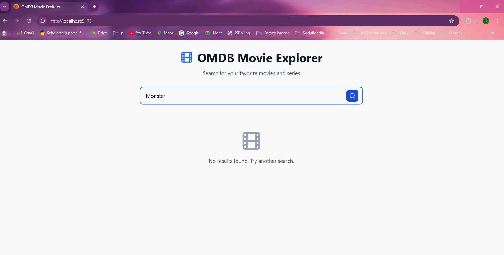
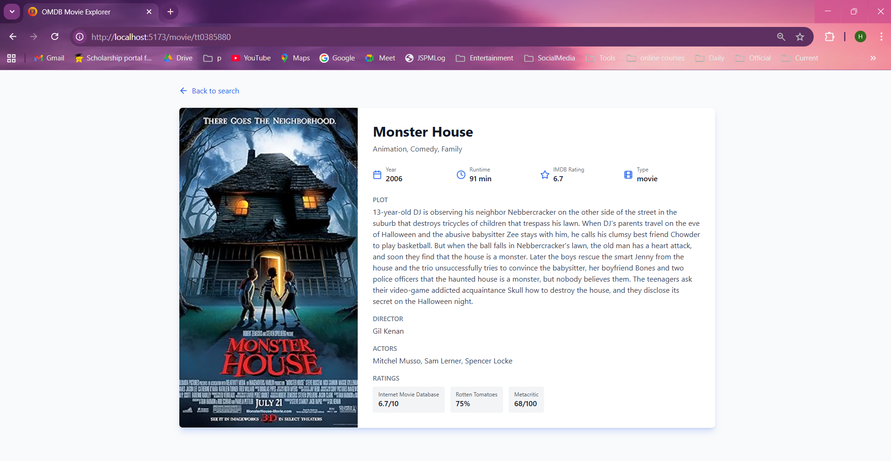
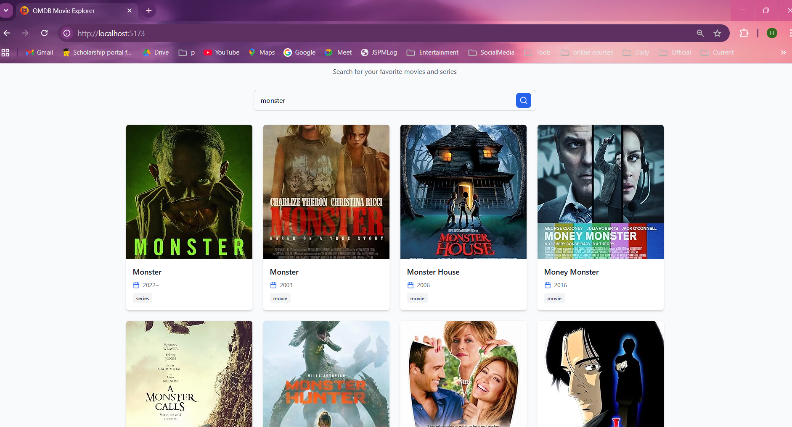
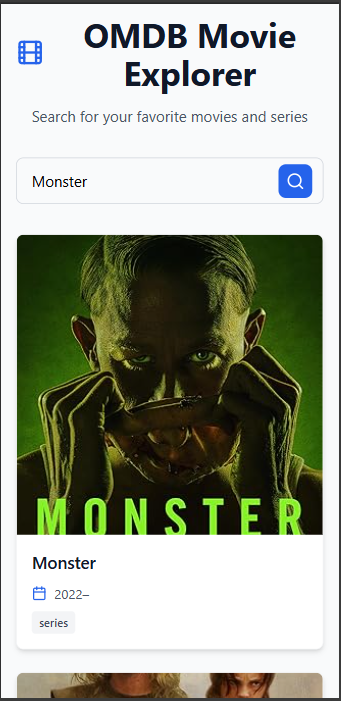
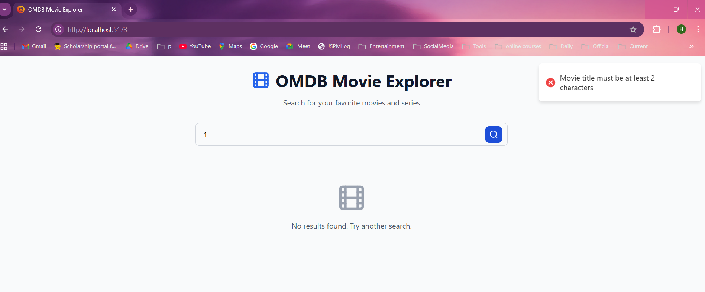
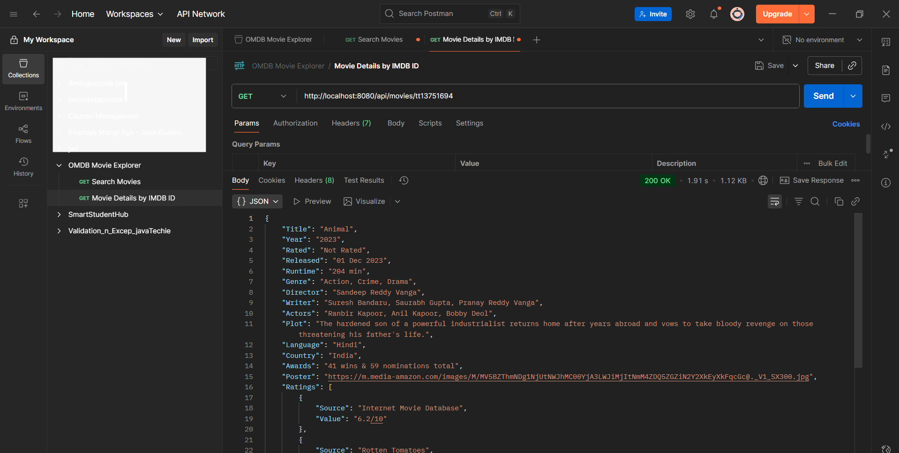

# 🎬 OMDB Movie Explorer

A full-stack web application built to search, discover, and explore movies using the OMDb API.

---

## 🎯 Problem Statement
Movie enthusiasts often need to search across multiple platforms to find comprehensive movie information. This application provides a unified interface to:
- Search movies and series by title
- View detailed information including plot, cast, and ratings
- Access data quickly through intelligent caching
- Enjoy a seamless, responsive user experience
---


## ✨ Key Features

### 🔍 Search Functionality
- **Real-time Search:** Instant search results as you type
- **Smart Validation:** Input validation prevents unnecessary API calls
- **Error Handling:** User-friendly error messages with toast notifications

### 🎬 Movie Discovery
- **Grid Layout:** Responsive card-based movie display
- **Visual Feedback:** Smooth hover effects with blue shadow glow

### 📊 Detailed View
- **Comprehensive Information:** Plot, director, actors, runtime, and genre
- **Multiple Ratings:** IMDB, Rotten Tomatoes, and Metacritic scores
- **Clean Layout & Easy Navigation:** Two-column responsive design (poster + details) & Back button to return

### ⚡ Performance Optimization
- **Intelligent Caching:** Results cached for 60 minutes
- **Cache Size Management:** Maximum 1000 entries to optimize memory
- **Reduced API Calls:** Faster response times for repeated searches

### 🎨 User Experience
- **Responsive Design:** Seamless experience on mobile, tablet, and desktop
- **Toast Notifications:** Success and error messages in top-right corner
- **Modern UI:** Clean design with Tailwind CSS and Lucide icons

---

## ⚙️ Technology Stack

**🖥️ Backend**

| Technology | Purpose |
|------------|---------|
| **Java 21** | Programming language |
| **Spring Boot 3.2.0** | REST API framework |
| **Spring Web** | RESTful web services |
| **Spring Cache** | Caching abstraction layer |
| **Caffeine Cache** | High-performance in-memory caching |
| **Lombok** | Reduce boilerplate code |
| **Maven** | Build & dependency management |

**💻 Frontend**

| Technology | Purpose |
|------------|---------|
| **React 18+ (Vite)** | Fast modern frontend framework |
| **React Router v6** | Client-side routing |
| **Axios** | HTTP client for API calls |
| **Tailwind CSS v4** | Utility-first styling |
| **Lucide React** | Modern icon library |
| **React Hot Toast** | Toast notification system |

---

## 🏗️ Project Architecture

The project follows a classic client-server model:


### Backend Structure
```
backend/
├── config/              # Configuration classes
│   ├── CacheConfig      # Caffeine cache setup
│   └── CorsConfig       # CORS configuration
├── controller/          # REST API endpoints
│   └── MovieController  # Search & detail endpoints
├── service/             # Business logic layer
│   └── MovieService     # Caching & validation
├── client/              # External API communication
│   └── OmdbApiClient    # OMDB API integration
├── dto/                 # Data Transfer Objects
│   ├── MovieSearchResponse
│   ├── MovieDetailResponse
│   └── ErrorResponse
└── exception/           # Error handling
    ├── GlobalExceptionHandler
    └── OmdbApiException
```

### Frontend Structure
```
frontend/
├── components/          # Reusable components
│   ├── SearchBar        # Search input with icon
│   └── MovieCard        # Movie display card
├── pages/               # Page components
│   ├── HomePage         # Search & results
│   └── MovieDetailPage  # Movie details
└── services/            # API integration
    └── movieService     # Backend API calls
```

---

## 🧮 API Endpoints

| Function | Method | Endpoint |
| :--- | :--- | :--- |
| Search for movies by title | `GET` | `/api/movies/search?title={title}` |
| Get detailed information by imdbId | `GET` | `/api/movies/{imdbId}` |

---

## 🧾 Output Showcase
Below are some of the sample outputs/screenshots of the system:

| Image Name | Output |
|----------|-------------|
| Home Page |  |
| Search Results |  |
| Movie Details |  |
| Results Grid Layout |  |
| Mobile View-1 |  |
| Mobile View-2 |  |
| Input Validation |  |
| Postman Testing |  |

---

## 🚀 Getting Started

### Prerequisites
- **Java 17+** installed
- **Node.js 18+** and npm installed
- **OMDB API Key** (Get free key from [omdbapi.com](http://www.omdbapi.com/apikey.aspx))

### Backend Setup

1. **Clone the repository**
```bash
git clone https://github.com/HaridasKhambe/omdb-movie-explorer.git
cd omdb-movie-explorer/ome-backend
```

2. **Configure API Key**

Open `src/main/resources/application.properties` and add your OMDB API key:
```properties
omdb.api.key=YOUR_API_KEY_HERE
```

3. **Run the backend**
```bash
mvn clean install
mvn spring-boot:run
```

Backend will start on `http://localhost:8080`

### Frontend Setup

1. **Navigate to frontend folder**
```bash
cd ../ome-frontend
```

2. **Install dependencies**
```bash
npm install
```

3. **Start the development server**
```bash
npm run dev
```

Frontend will start on `http://localhost:5173`

### Access the Application
Open your browser and visit: `http://localhost:5173`

---

## 💡 Bonus Features Implemented

| Feature | Description | Value Added |
|---------|-------------|-------------|
| **Toast Notifications** | Real-time success/error messages | Enhanced user feedback |
| **Loading States** | Spinners during API calls | Professional UX |
| **Input Validation** | Client & server-side validation | Prevents bad requests |
| **Icon Integration** | Lucide React icons | Clean, modern aesthetics |

---

## 🔮 Future Enhancements

- 🌟 **Favorites Feature:** Save favorite movies using localStorage
- 🔐 **User Authentication:** Personal movie collections
- 🎨 **Theme Toggle:** Light/dark mode support
- 🔍 **Advanced Filters:** Filter by year, genre, rating
- 📊 **Watch History:** Track viewed movies

---


---
